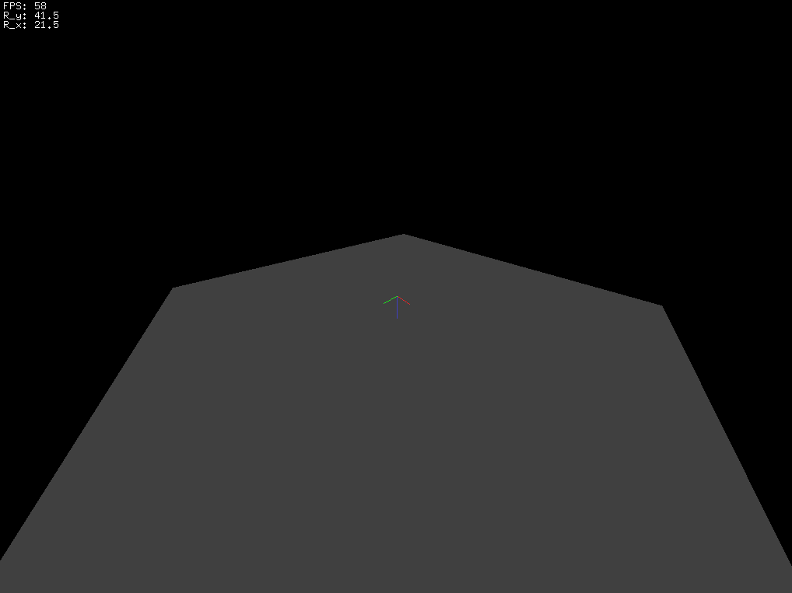

# opengl-template

This program serves as a template for graphical applications. The program renders a plane in the origin and it provides a simple HUD to display, e.g., text. Handling keystrokes as well as mouse inputs (zoom via mousewheel as well as drag and drop rotation on the left mouse button) are available.

## Folder Structure

This project has the following folder structure
```
.
├── build (compilated executables)
├── doc (documentation)
├── include (header files: *.hpp)
├── obj (object files created during compilation: *.obj)
└── src (source files: *.cpp)
```

## Dependencies

To run the program, installation of (free)glut is mandatory. Additional information about freeglut can be found on <http://freeglut.sourceforge.net/>. Installation packages for (64 bit) Red Hat Linux systems are provided by

- freeglut.x86_64
- freeglut-devel.x86_64

## Running the Program

This program can be run using the provided makefile (using the commands `make` and `make run`).

## Additional Information

When changing the folder structure, e.g., when copying this repository make sure to correct the header include path in the makefile (see variable`HEADERINCLUDE`).

A video of the program in action (with some additional objects rendered) can be found at <https://www.youtube.com/watch?v=k9RCvI3zMAs>. An image of the program output, as provided in this repository, can be seen in the the image below


